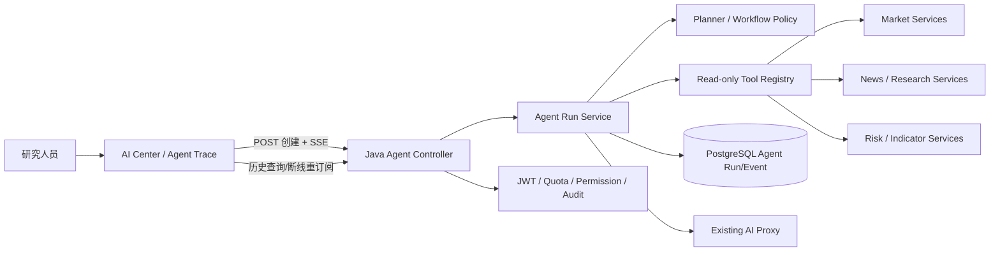

# 金融 Agent 工作流设计

## 1. 设计原则

- 事件先行：前后端共享稳定的 Agent Event 协议，UI 不依赖后端内部类名。
- 可观察而非暴露思维链：展示计划摘要、工具调用和证据，不展示模型隐式推理原文。
- 只读工具优先：首期工具均为行情、指标、新闻、财报和风险读取操作。
- 认证边界不下移：浏览器仍只访问 Java 主后端，Java 负责 JWT、配额、权限和审计。
- 可恢复：运行有唯一 ID，事件可查询，连接断开后可根据 runId 恢复。

## 2. 逻辑架构



## 3. 事件协议

每个事件至少包含：

```json
{
  "runId": "uuid",
  "stepId": "uuid",
  "sequence": 4,
  "type": "tool_result",
  "status": "completed",
  "title": "行情工具执行完成",
  "tool": "MarketQuoteTool",
  "inputSummary": "gold_etf",
  "outputSummary": "价格、涨跌幅与更新时间已取得",
  "payload": { "source": "jarvis-market" },
  "startedAt": "2026-09-20T10:00:00Z",
  "finishedAt": "2026-09-20T10:00:01Z",
  "durationMs": 1000,
  "errorCode": null
}
```

事件类型：`run_started`、`plan_created`、`step_started`、`tool_call`、`tool_result`、`step_completed`、`assistant_delta`、`run_completed`、`run_failed`、`run_cancelled`。

## 4. 后端边界

- `AgentController`：创建运行、SSE 流、历史重订阅、查询运行、查询事件、取消运行。
- `AgentRunService`：运行生命周期、取消信号、事件发布、PostgreSQL 持久化和事件重放。
- `AgentToolRegistry`：工具名称、参数校验、只读能力声明和执行器映射。
- `AgentEvent`：对外协议对象，不直接暴露异常堆栈或内部凭据。
- AI 中心最终回答可继续复用已有 AI Proxy；Agent 运行上下文通过服务端生成，客户端不能伪造服务端行情指标。

本阶段新增 `agent_run` 与 `agent_event` 两张最小表，由 `V12__agent_runs.sql` 管理；活动 SSE 订阅器只保留在内存，历史与恢复以数据库为准。

## 5. 前端交互

- `AgentTracePanel` 接收事件数组和运行状态，不自行生成假事件。
- 每个节点显示状态圆点、类型、标题、工具名、耗时和简短摘要。
- 工具输入/输出默认折叠，展开后仍展示脱敏摘要。
- 运行中提供“停止”；失败提供“恢复轨迹”；历史抽屉可按 `runId` 查询事件并在运行未结束时重新订阅。
- 最终 Markdown 回答与运行轨迹分离，避免输出内容挤压执行信息。
- 使用现有 workspace 主题 token；新增组件不使用 Emoji 图标。

## 6. 安全与资源控制

- Agent 创建和工具调用复用 JWT、功能权限、AI 配额和审计。
- 每次运行限制最大步骤数、总时长、工具并发度和单个事件大小。
- 工具输入、输出和错误统一脱敏；禁止记录 API Key、Cookie、Authorization 和内部服务令牌。
- 停止运行必须传播到执行器，避免只停止浏览器连接而继续消耗上游额度。

## 7. 测试策略

- Java：事件序列、工具注册、权限/配额、取消、失败脱敏、SSE 生命周期。
- 前端：事件归并、轨迹状态、展开/折叠、停止/重试和断线恢复。
- 集成：创建运行后能看到真实工具事件，完成后能读取历史。
- 浏览器：AI 中心提交研究问题、观察 Trace、停止运行、查看 Markdown 结论。
